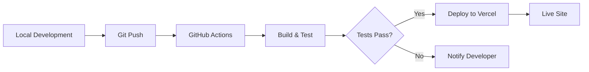

# Scalevirtual.co - Complete Tech Stack & Architecture

## 🎯 Overview
Modern, high-performance landing page with smooth scrolling, 3D animations, and premium design.

---

## 🛠️ Technology Stack

### Core Framework
- **Next.js 14+** (React 18.2)
  - App Router for routing
  - Static Site Generation (SSG)
  - Image optimization
  - SEO-friendly

### Animation Libraries

#### 1. GSAP 3.12+ (GreenSock Animation Platform)
**Why**: Industry-standard, best performance, 60fps animations

**Features**:
- ScrollTrigger: Scroll-based animations
- Timeline: Complex animation sequences
- Ease functions: Custom easing curves
- Performance: Hardware-accelerated

**Usage**:
```javascript
gsap.from('.element', {
  scrollTrigger: {
    trigger: '.element',
    start: 'top 80%',
    toggleActions: 'play none none reverse'
  },
  y: 100,
  opacity: 0,
  duration: 1,
  ease: 'power3.out'
})
```

#### 2. Lenis (by Studio Freight)
**Why**: Smoothest scroll experience, modern, lightweight

**Features**:
- Velocity-based smooth scrolling
- Touch-friendly
- Momentum scrolling
- CSS3 transforms
- 60fps performance

**Usage**:
```javascript
const lenis = new Lenis({
  duration: 1.2,
  easing: (t) => Math.min(1, 1.001 - Math.pow(2, -10 * t)),
  smooth: true
})

function raf(time) {
  lenis.raf(time)
  requestAnimationFrame(raf)
}

requestAnimationFrame(raf)
```

#### 3. Framer Motion
**Why**: React-specific, declarative animations

**Features**:
- Component animations
- Layout animations
- Gesture animations
- Variants for complex states

**Usage**:
```typescript
import { motion } from 'framer-motion'

<motion.div
  initial={{ opacity: 0, y: 50 }}
  whileInView={{ opacity: 1, y: 0 }}
  transition={{ duration: 0.6 }}
>
  Content
</motion.div>
```

#### 4. Three.js + React Three Fiber (Optional)
**Why**: WebGL 3D graphics, interactive elements

**Features**:
- 3D backgrounds
- Particle systems
- Interactive models
- Post-processing effects

**Usage**:
```typescript
import { Canvas } from '@react-three/fiber'
import { Float } from '@react-three/drei'

<Canvas>
  <Float speed={2} rotationIntensity={1}>
    <mesh>
      <boxGeometry />
      <meshStandardMaterial color="#005E3E" />
    </mesh>
  </Float>
</Canvas>
```

---

## 🏗️ Architecture

### File Structure
```
scalevirtual/
├── public/                      # Static assets
│   ├── logo.svg
│   ├── icon.svg
│   └── images/
├── src/
│   ├── app/                     # Next.js App Router
│   │   ├── layout.tsx          # Root layout
│   │   ├── page.tsx            # Home page
│   │   ├── globals.css         # Global styles
│   │   └── fonts/              # Custom fonts
│   ├── components/              # React components
│   │   ├── Navigation/
│   │   │   ├── index.tsx
│   │   │   └── styles.module.css
│   │   ├── Hero/
│   │   │   ├── index.tsx
│   │   │   ├── Hero3D.tsx      # 3D elements
│   │   │   └── styles.module.css
│   │   ├── Services/
│   │   │   ├── index.tsx
│   │   │   ├── ServiceCard.tsx
│   │   │   └── styles.module.css
│   │   ├── CTA/
│   │   │   ├── index.tsx
│   │   │   └── styles.module.css
│   │   └── common/
│   │       ├── Button.tsx
│   │       └── Card.tsx
│   ├── lib/                     # Utilities
│   │   ├── gsap-config.ts      # GSAP setup
│   │   ├── lenis-setup.ts      # Lenis setup
│   │   └── animations.ts       # Animation presets
│   ├── hooks/                   # Custom hooks
│   │   ├── useScrollAnimation.ts
│   │   ├── useLenis.ts
│   │   └── useMousePosition.ts
│   ├── styles/                  # Global styles
│   │   ├── variables.css       # CSS variables
│   │   └── animations.css      # Animation classes
│   └── types/                   # TypeScript types
│       └── index.ts
├── .github/
│   └── workflows/
│       └── deploy.yml          # Auto-deployment
├── package.json
├── next.config.js
├── tailwind.config.ts
├── tsconfig.json
└── .env.local
```

---

## 🎨 Design System

### Color Palette
```css
:root {
  --background: #EEEAE3;    /* Warm beige background */
  --foreground: #F5F0E8;    /* Light cream for cards */
  --green: #005E3E;         /* Deep green accent */
  --grey: #5A5959;          /* Medium grey for text */
  --black: #000000;         /* Pure black for headers */
}
```

### Typography
```css
/* Primary Font: Poppins */
font-family: 'Poppins', sans-serif;
Weights: 300, 400, 500, 600, 700

/* Accent Font: Times New Roman */
font-family: 'Times New Roman', serif;
Style: Italic for emphasis
```

### Spacing Scale
```css
--space-xs: 0.5rem;    /* 8px */
--space-sm: 1rem;      /* 16px */
--space-md: 1.5rem;    /* 24px */
--space-lg: 2rem;      /* 32px */
--space-xl: 3rem;      /* 48px */
--space-2xl: 4rem;     /* 64px */
--space-3xl: 6rem;     /* 96px */
```

### Border Radius
```css
--radius-sm: 8px;
--radius-md: 16px;
--radius-lg: 24px;
--radius-xl: 32px;
--radius-full: 9999px;
```

---

## 🎬 Animation Principles

### 1. Duration & Easing
```javascript
// Fast interactions (buttons, links)
duration: 0.3s
easing: cubic-bezier(0.4, 0, 0.2, 1)

// Medium animations (cards, sections)
duration: 0.6-0.8s
easing: power3.out

// Slow animations (page transitions)
duration: 1-1.2s
easing: power4.out
```

### 2. Scroll-Based Animations
```javascript
// Entry animation
{
  scrollTrigger: {
    trigger: '.element',
    start: 'top 85%',      // When element is 85% down viewport
    end: 'top 20%',        // When element is 20% down viewport
    toggleActions: 'play none none reverse'
  },
  y: 100,
  opacity: 0,
  duration: 1
}
```

### 3. Stagger Effect
```javascript
gsap.from('.cards', {
  y: 100,
  opacity: 0,
  stagger: 0.15,  // 150ms delay between each
  duration: 0.8
})
```

### 4. Parallax Effect
```javascript
gsap.to('.background', {
  scrollTrigger: {
    trigger: '.section',
    start: 'top top',
    end: 'bottom top',
    scrub: 1  // Smooth scrubbing
  },
  y: -200,
  scale: 1.2
})
```

---

## 🔧 Key Features Implementation

### 1. Smooth Scrolling (Lenis)
```typescript
// lib/lenis-setup.ts
import Lenis from '@studio-freight/lenis'

export function initLenis() {
  const lenis = new Lenis({
    duration: 1.2,
    easing: (t) => Math.min(1, 1.001 - Math.pow(2, -10 * t)),
    orientation: 'vertical',
    smoothWheel: true,
    smoothTouch: false,
    touchMultiplier: 2
  })

  function raf(time: number) {
    lenis.raf(time)
    requestAnimationFrame(raf)
  }

  requestAnimationFrame(raf)
  
  return lenis
}
```

### 2. Scroll-Triggered Animations
```typescript
// hooks/useScrollAnimation.ts
import { useEffect, useRef } from 'react'
import gsap from 'gsap'
import ScrollTrigger from 'gsap/ScrollTrigger'

export function useScrollAnimation() {
  const ref = useRef(null)

  useEffect(() => {
    gsap.registerPlugin(ScrollTrigger)

    const element = ref.current

    gsap.from(element, {
      scrollTrigger: {
        trigger: element,
        start: 'top 80%',
        toggleActions: 'play none none reverse'
      },
      y: 100,
      opacity: 0,
      duration: 1,
      ease: 'power3.out'
    })

    return () => {
      ScrollTrigger.getAll().forEach(t => t.kill())
    }
  }, [])

  return ref
}
```

### 3. 3D Card Tilt Effect
```typescript
// components/Card/Card.tsx
export function Card3D({ children }: { children: React.ReactNode }) {
  const cardRef = useRef<HTMLDivElement>(null)

  const handleMouseMove = (e: React.MouseEvent) => {
    if (!cardRef.current) return

    const rect = cardRef.current.getBoundingClientRect()
    const x = e.clientX - rect.left
    const y = e.clientY - rect.top
    const centerX = rect.width / 2
    const centerY = rect.height / 2
    const rotateX = (y - centerY) / 10
    const rotateY = (centerX - x) / 10

    gsap.to(cardRef.current, {
      rotationX: rotateX,
      rotationY: rotateY,
      duration: 0.5,
      ease: 'power2.out',
      transformPerspective: 1000
    })
  }

  const handleMouseLeave = () => {
    gsap.to(cardRef.current, {
      rotationX: 0,
      rotationY: 0,
      duration: 0.5
    })
  }

  return (
    <div
      ref={cardRef}
      onMouseMove={handleMouseMove}
      onMouseLeave={handleMouseLeave}
      style={{ transformStyle: 'preserve-3d' }}
    >
      {children}
    </div>
  )
}
```

### 4. Magnetic Buttons
```typescript
export function MagneticButton({ children }: { children: React.ReactNode }) {
  const buttonRef = useRef<HTMLButtonElement>(null)

  const handleMouseMove = (e: React.MouseEvent) => {
    if (!buttonRef.current) return

    const rect = buttonRef.current.getBoundingClientRect()
    const x = e.clientX - rect.left - rect.width / 2
    const y = e.clientY - rect.top - rect.height / 2

    gsap.to(buttonRef.current, {
      x: x * 0.3,
      y: y * 0.3,
      duration: 0.3,
      ease: 'power2.out'
    })
  }

  const handleMouseLeave = () => {
    gsap.to(buttonRef.current, {
      x: 0,
      y: 0,
      duration: 0.5,
      ease: 'elastic.out(1, 0.5)'
    })
  }

  return (
    <button
      ref={buttonRef}
      onMouseMove={handleMouseMove}
      onMouseLeave={handleMouseLeave}
    >
      {children}
    </button>
  )
}
```

---

## 📈 Performance Optimization

### 1. Code Splitting
```typescript
// Lazy load heavy components
import dynamic from 'next/dynamic'

const Hero3D = dynamic(() => import('./Hero3D'), {
  loading: () => <div>Loading...</div>,
  ssr: false  // Don't render on server
})
```

### 2. Image Optimization
```typescript
import Image from 'next/image'

<Image
  src="/logo.svg"
  alt="Logo"
  width={200}
  height={50}
  priority  // Load immediately for hero images
/>
```

### 3. GPU Acceleration
```css
.animated-element {
  will-change: transform, opacity;
  transform: translateZ(0);  /* Force GPU */
}
```

### 4. Debounce Scroll Events
```typescript
import { debounce } from 'lodash'

const handleScroll = debounce(() => {
  // Heavy scroll logic
}, 100)
```

---

## 🎯 Performance Targets

### Lighthouse Scores
- Performance: 95+
- Accessibility: 100
- Best Practices: 100
- SEO: 100

### Core Web Vitals
- **LCP** (Largest Contentful Paint): < 2.5s
- **FID** (First Input Delay): < 100ms
- **CLS** (Cumulative Layout Shift): < 0.1

### Animation Performance
- Consistent 60fps
- No jank on scroll
- Smooth on mobile
- < 5ms frame time

---

## 🚀 Deployment Flow



---

## 📊 Monitoring & Analytics

### 1. Google Analytics
```typescript
// Track page views
gtag('event', 'page_view', {
  page_location: window.location.href
})
```

### 2. Performance Monitoring
```typescript
// Track Web Vitals
import { getCLS, getFID, getFCP, getLCP, getTTFB } from 'web-vitals'

getCLS(console.log)
getFID(console.log)
getLCP(console.log)
```

### 3. Error Tracking
```typescript
// Sentry integration
import * as Sentry from '@sentry/nextjs'

Sentry.init({
  dsn: process.env.NEXT_PUBLIC_SENTRY_DSN
})
```

---

## 🎓 Learning Resources

### GSAP
- Docs: https://greensock.com/docs/
- Cheat Sheet: https://greensock.com/cheatsheet/
- Forum: https://greensock.com/forums/

### Lenis
- GitHub: https://github.com/studio-freight/lenis
- Demo: https://lenis.studiofreight.com/

### Next.js
- Docs: https://nextjs.org/docs
- Learn: https://nextjs.org/learn

### Three.js
- Docs: https://threejs.org/docs/
- Examples: https://threejs.org/examples/

---

## ✅ Deployment Checklist

- [ ] All animations working smoothly
- [ ] Mobile responsive
- [ ] Cross-browser tested (Chrome, Firefox, Safari)
- [ ] Lighthouse score > 95
- [ ] SEO meta tags configured
- [ ] Social media previews working
- [ ] Analytics integrated
- [ ] Error tracking setup
- [ ] Performance monitoring active
- [ ] SSL certificate active
- [ ] Custom domain configured
- [ ] Backup strategy in place

---

**Built with ❤️ using modern web technologies**
